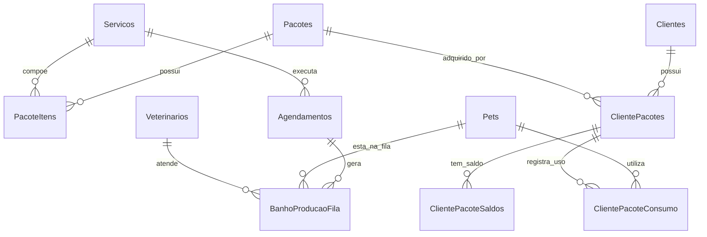

# Plano de Implementação - Módulo de Banho e Tosa (DinoVet)

Este planejamento detalha a criação do módulo completo de **Banho e Tosa**, exclusivo para o **Modo Vet** (`AppHelper::isVetMode()`). O módulo abrange desde a parametrização de serviços e combos/pacotes recorrentes até a linha de produção em tempo real (TV), agenda por colaborador/banhista e autoatendimento do tutor na Área do Cliente (*mobile-first*).

---

## User Review Required

> [!IMPORTANT]
> **Decisões Estruturais & Regras de Negócio**:
> 1. **Diferenciação de Agendas (Vet vs Banho)**:
>    - Adicionaremos uma coluna `tipo_agenda` (ou `modulo_origem`) na tabela de agendamentos (`'clinica'`, `'banho_tosa'`). Se um colaborador for tanto veterinário quanto banhista/tosador, seus horários clínicos e de estética não se misturam nas visões de calendário, permitindo filtragem limpa e sem conflitos operacionais.
> 2. **Consumo de Pacotes vs Itens Avulsos**:
>    - Um pacote adquirido pelo cliente gera um registro de saldo por serviço. Ao agendar pelo painel ou pela Área do Cliente, o sistema verifica a disponibilidade de saldo do pacote ativo; se houver saldo, o agendamento consome 1 unidade do combo. Caso contrário, aplica-se o valor avulso do serviço.
> 3. **Integração Financeira das Recorrências**:
>    - Pacotes marcados como "Recorrentes" serão vinculados à tabela de `Recorrencias` existente. Quando a clínica acionar o botão "Incorporar Recorrências", uma nova fatura será gerada e um novo ciclo de créditos de serviços será injetado no saldo do cliente.

---

## Estrutura do Banco de Dados Proposta

### Novas Tabelas e Alterações

1. **Alterações na tabela `Servicos`**:
   - `disponivel_clinica` (TINYINT(1) DEFAULT 1) - Indica se o serviço aparece no módulo clínica/consultas.
   - `disponivel_banho` (TINYINT(1) DEFAULT 0) - Indica se o serviço é de estética/banho e tosa.
   - `duracao_minutos` (INT DEFAULT 30) - Duração padrão do serviço para grade de agenda.
   - `icone_servico` (VARCHAR(100) DEFAULT 'pets') - Nome do ícone Material Icons.
   - `imagem_url` (VARCHAR(255) NULL) - Foto/ilustração do serviço na vitrine.

2. **Tabela `Pacotes`**:
   - `id_pacote` (INT AUTO_INCREMENT PRIMARY KEY)
   - `nome_pacote` (VARCHAR(150) NOT NULL)
   - `descricao` (TEXT NULL)
   - `valor_total` (DECIMAL(10,2) NOT NULL)
   - `is_recorrente` (TINYINT(1) DEFAULT 0)
   - `intervalo_dias_recorrencia` (INT DEFAULT 30) - Para integração com `Recorrencias`.
   - `icone` (VARCHAR(100) DEFAULT 'card_giftcard')
   - `imagem_url` (VARCHAR(255) NULL)
   - `ativo` (TINYINT(1) DEFAULT 1)
   - `criado_em` (DATETIME DEFAULT CURRENT_TIMESTAMP)

3. **Tabela `PacoteItens`**:
   - `id_item` (INT AUTO_INCREMENT PRIMARY KEY)
   - `id_pacote` (INT NOT NULL, FK `Pacotes`)
   - `id_servico` (INT NOT NULL, FK `Servicos`)
   - `quantidade` (INT NOT NULL DEFAULT 1)

4. **Tabela `ClientePacotes`**:
   - `id_cliente_pacote` (INT AUTO_INCREMENT PRIMARY KEY)
   - `id_cliente` (INT NOT NULL, FK `Clientes`)
   - `id_pacote` (INT NOT NULL, FK `Pacotes`)
   - `id_recorrencia` (INT NULL, FK `Recorrencias`)
   - `data_aquisicao` (DATETIME DEFAULT CURRENT_TIMESTAMP)
   - `status` (ENUM('ativo', 'esgotado', 'cancelado') DEFAULT 'ativo')

5. **Tabela `ClientePacoteSaldos`**:
   - `id_saldo` (INT AUTO_INCREMENT PRIMARY KEY)
   - `id_cliente_pacote` (INT NOT NULL, FK `ClientePacotes`)
   - `id_servico` (INT NOT NULL, FK `Servicos`)
   - `qtd_total` (INT NOT NULL)
   - `qtd_utilizada` (INT NOT NULL DEFAULT 0)

6. **Tabela `ClientePacoteConsumo`**:
   - `id_consumo` (INT AUTO_INCREMENT PRIMARY KEY)
   - `id_cliente_pacote` (INT NOT NULL, FK `ClientePacotes`)
   - `id_servico` (INT NOT NULL, FK `Servicos`)
   - `id_pet` (INT NOT NULL, FK `Pets`)
   - `id_agendamento` (INT NULL, FK `Agendamentos`)
   - `data_consumo` (DATETIME DEFAULT CURRENT_TIMESTAMP)
   - `observacao` (VARCHAR(255) NULL)

7. **Alteração na tabela `Agendamentos`**:
   - `tipo_agenda` (ENUM('clinica', 'banho_tosa') DEFAULT 'clinica')
   - `id_cliente_pacote` (INT NULL, FK `ClientePacotes`)
   - `id_servico` (INT NULL, FK `Servicos`)

8. **Tabela `BanhoProducaoFila` (Linha de Produção)**:
   - `id_fila` (INT AUTO_INCREMENT PRIMARY KEY)
   - `id_agendamento` (INT NULL, FK `Agendamentos`)
   - `id_pet` (INT NOT NULL, FK `Pets`)
   - `id_colaborador` (INT NULL, FK `Veterinarios`)
   - `etapa` (ENUM('aguardando', 'em_banho', 'secagem_tosa', 'pronto', 'entregue') DEFAULT 'aguardando')
   - `horario_entrada` (DATETIME DEFAULT CURRENT_TIMESTAMP)
   - `horario_inicio` (DATETIME NULL)
   - `horario_fim` (DATETIME NULL)
   - `observacoes_estetica` (TEXT NULL) - Alergias, nós, tosa alta/baixa, perfume sim/não.
   - `ordem` (INT DEFAULT 0)

---

## Divisão do Desenvolvimento em Sprints

### Sprint 1: Fundação, Parâmetros e Gestão de Pacotes
- **Objetivo**: Modelar o banco de dados e viabilizar a criação de serviços com tempo de duração e combos de pacotes.
- **Entregáveis**:
  1. Migração SQL com todas as tabelas e colunas novas.
  2. Atualização de `servico_form.php` e `servicos.php` para incluir:
     - Checkbox "Disponível na Clínica" e "Disponível no Banho e Tosa".
     - Campo "Tempo Padrão de Duração (min)".
     - Seletor de Ícone / Upload de imagem para vitrine.
  3. Nova tela `dinovatech/modules/Vet/pacotes.php` e `pacote_form.php` para cadastrar pacotes e seus serviços componentes.
  4. Vínculo financeiro: criar gatilho/ação para pacotes recorrentes integrarem na tabela `Recorrencias`.

### Sprint 2: Agenda de Banho & Tosa e Alocação por Funcionário
- **Objetivo**: Separar e gerenciar a agenda de estética pet com cálculo de slots baseado no tempo padrão dos serviços.
- **Entregáveis**:
  1. Criação de tela/aba `dinovatech/modules/Vet/banho_agenda.php` ou extensão da agenda com seletor de modo (`Clínica` vs `Banho e Tosa`).
  2. Filtro por profissional (colaboradores/banhistas/tosadores).
  3. Alocação de slots dinâmica: ao escolher o serviço (ex: Banho e Tosa - 30min), o sistema já calcula o término `data_fim` conforme o tempo cadastrado.
  4. Detecção de saldo de pacotes do cliente no momento da marcação interna.

### Sprint 3: Linha de Produção (Kanban Operacional & Modo TV)
- **Objetivo**: Criar o painel visual da esteira de trabalho do banho e tosa em tempo real com suporte a exibição em TV.
- **Entregáveis**:
  1. Nova tela `dinovatech/modules/Vet/banho_producao.php` (Kanban com colunas: *Aguardando*, *No Banho*, *Secagem / Tosa*, *Pronto para Entrega*, *Finalizado*).
  2. Drag and drop ou clique rápido para transição de status dos pets.
  3. **Modo TV**: Visão limpa em tela cheia (dark/high-contrast), fontes grandes, cards com foto da raça/pet, nome do tutor e status atualizado dinamicamente via polling leve a cada 10-15 segundos.
  4. Botão de notificação rápida (ex: link direto para WhatsApp com mensagem "Seu pet está pronto!").

### Sprint 4: Central do Cliente (Mobile-First) & Dashboard
- **Objetivo**: Permitir ao tutor acompanhar e agendar banhos pelo smartphone e exibir indicadores na dashboard principal da clínica.
- **Entregáveis**:
  1. **Área do Cliente (`cliente/index.php`)**:
     - Nova aba "Banho & Tosa" (visível apenas em Modo Vet).
     - Card de resumo de pacotes ativos com medidor visual de progresso (ex: "Banho Simples: 2/3 restantes").
     - Formulário *mobile-first* de agendamento:
       - Seleciona o Pet -> Seleciona o Serviço -> Se tiver pacote ativo para o serviço, informa "1 crédito do Pacote PetBasic"; se não tiver, exibe o valor avulso -> Escolhe data/horário e profissional.
  2. **Dashboard da Clínica (`dinovatech/dashboard.php`)**:
     - Novo Card/Widget de Banho & Tosa:
       - Pacotes Ativos vs Esgotados.
       - Tabela com últimos serviços consumidos (Pet, Tutor, Serviço, Data/Hora, Profissional).
       - Gráfico/Contador de banhos realizados no dia/mês.

---

## Ideias Inovadoras para Maximizar Agilidade e Utilidade

1. **Ficha de Preferências do Pet no Banho**:
   - Salvar preferências fixas no cadastro do pet (ex: *alérgico a perfume*, *medo de soprador*, *tosa padrão tesoura 2cm*, *não cortar unhas*). Essas tags aparecem automaticamente no card do Kanban e na TV/painel do banhista.
2. **Multiplicador de Tempo por Porte/Pelagem**:
   - Pets de porte grande ou pelo longo podem ter um fator de multiplicação de tempo configurável (ex: Porte P = 1x (30min), Porte G / Pelo Longo = 2x (60min)), evitando gargalos na agenda.
3. **Check-in com Foto de Avarias / Nós**:
   - No momento da recepção do pet, o colaborador pode tirar uma foto pelo celular apontando nós intensos ou ferimentos pré-existentes, gerando um histórico seguro antes do procedimento.
4. **Mensageria WhatsApp Automatizada**:
   - Ao mover o card para a coluna "Pronto", exibir atalho para disparar mensagem padrão no WhatsApp do tutor: *"Olá [Tutor], o [Pet] já terminou o banho e está cheiroso pronto para te esperar!"*.

---

## Proposed Changes (Arquivos a serem criados/modificados)

### Database Migrations
#### [NEW] `database/migrations/20260817_0001_create_banho_tosa_schema.sql`

### Backend & Modelos
#### [MODIFY] `dinovatech/app.php` (ações AJAX de pacotes, consumo, fila de produção e agendamentos)
#### [MODIFY] `dinovatech/servico_form.php` (campos de duração, sinalizadores e ícone)
#### [MODIFY] `dinovatech/servicos.php` (listagem com badge de módulo e duração)

### Painéis do Módulo Vet
#### [NEW] `dinovatech/modules/Vet/pacotes.php` & `pacote_form.php`
#### [NEW] `dinovatech/modules/Vet/banho_agenda.php`
#### [NEW] `dinovatech/modules/Vet/banho_producao.php` (Kanban + Modo TV)
#### [MODIFY] `dinovatech/components/sidebar.php` (novo item de menu "Banho e Tosa" sob modo Vet)
#### [MODIFY] `dinovatech/dashboard.php` (widget de pacotes e consumo)

### Área do Cliente
#### [MODIFY] `cliente/index.php` (aba de Banho & Tosa, saldo de pacotes e agendamento mobile-first)

---

## Verification Plan

### Testes Manuais & Validação
1. **Cadastro de Serviços e Pacotes**:
   - Criar serviço "Banho Padrão" (30min, Banho e Tosa = Sim, Clínica = Não).
   - Criar pacote "PetBasic" com 3 banhos normais e 1 tosa higiênica, marcar recorrência mensal.
   - Atribuir o pacote a um cliente e validar o saldo de 3 e 1 criado em `ClientePacoteSaldos`.
2. **Agenda e Consumo de Pacote**:
   - Realizar agendamento para o pet do cliente.
   - Validar que o saldo do pacote foi decrementado de 3 para 2 e registrado no histórico de consumo.
3. **Linha de Produção & Modo TV**:
   - Abrir o painel de produção e simular avanço de etapas (Aguardando -> Banho -> Secagem -> Pronto).
   - Testar o Modo TV em tela cheia e verificar se atualiza sem recarregar a página inteira.
4. **Área do Cliente**:
   - Fazer login com CPF do cliente na área do cliente mobile.
   - Conferir visualização dos créditos restantes do pacote e agendar novo horário avulso ou com pacote.
