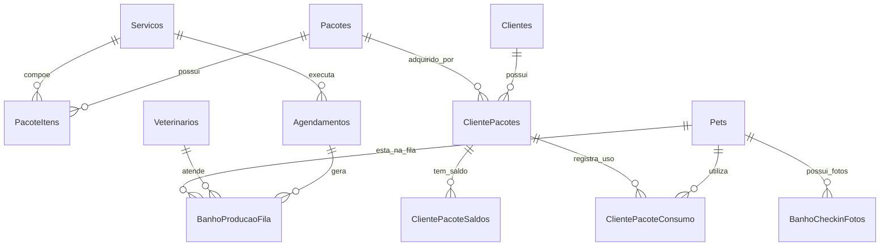

# Plano de Implementação - Módulo de Banho e Tosa (DinoVet)

Este planejamento detalha a criação do módulo completo de **Banho e Tosa**, exclusivo para o **Modo Vet** (`AppHelper::isVetMode()`), incorporando todas as diretrizes operacionais, preferências do pet, regras de tempo por porte, mensageria (WhatsApp/Gmail), sincronização Google Calendar e parametrização configurável de check-in fotográfico.

---

## User Review Required

> [!IMPORTANT]
> **Decisões Estruturais & Novas Funcionalidades Aprovadas**:
> 1. **Diferenciação e Sincronização de Agendas**:
>    - Campo `tipo_agenda` (`'clinica'`, `'banho_tosa'`) na tabela `Agendamentos`. Se um colaborador for tanto veterinário quanto banhista/tosador, suas agendas permanecem desacopladas.
>    - **Google Calendar Sync**: O agendamento do Banho e Tosa sincronizará com a agenda Google do profissional e inserirá o cliente como convidado (`attendees`) caso este possua e-mail ou `google_calendar_id` configurado.
> 2. **Preferências Fixas do Pet & Multiplicador de Tempo**:
>    - Campos/tags no cadastro do Pet para preferências de estética (alergias a perfumes, medo de soprador, tipo de tosa, corte de unhas). Essas informações serão exibidas de forma proeminente no Kanban, na TV e no formulário de agendamento.
>    - Multiplicador de tempo baseado no Porte (P, M, G, GG) e tipo de pelagem (Curto, Médio, Longo), recalculando a duração do serviço na agenda.
> 3. **Check-in com Foto Opcional (Configuração do Sistema)**:
>    - Nova flag em `ConfiguracoesEmissor` (ex: `banho_checkin_foto_ativo = 1/0`). Quando ativado, permite anexar fotos de nós e avarias pré-existentes na recepção do pet.
> 4. **Mensageria ao Concluir (WhatsApp e Gmail)**:
>    - Ao mover o card do pet para a coluna "Pronto", a clínica terá botões de ação direta: disparo de mensagem no WhatsApp do tutor e envio de e-mail automatizado via integração Gmail existente.

---

## Estrutura do Banco de Dados Atualizada

### Novas Tabelas e Alterações Estruturais

1. **Alterações na tabela `Servicos`**:
   - `disponivel_clinica` (TINYINT(1) DEFAULT 1) - Disponibilidade para o módulo clínico.
   - `disponivel_banho` (TINYINT(1) DEFAULT 0) - Disponibilidade para o módulo de banho e tosa.
   - `duracao_minutos` (INT DEFAULT 30) - Tempo padrão de duração.
   - `icone_servico` (VARCHAR(100) DEFAULT 'pets') - Ícone Material Icons.
   - `imagem_url` (VARCHAR(255) NULL) - Imagem para vitrine / seleção.

2. **Alterações na tabela `Pets`**:
   - `porte` (ENUM('P', 'M', 'G', 'GG') DEFAULT 'P')
   - `tipo_pelagem` (ENUM('Curto', 'Medio', 'Longo', 'Dupla Pelagem') DEFAULT 'Curto')
   - `preferencias_banho` (TEXT NULL) - Tags/observações (ex: "Alérgico a perfume", "Medo de soprador", "Tosa higiênica baixa").

3. **Alterações na tabela `ConfiguracoesEmissor`**:
   - `banho_checkin_foto_ativo` (TINYINT(1) DEFAULT 0) - Ativa/desativa o check-in com foto na recepção.

4. **Tabela `Pacotes`**:
   - `id_pacote` (INT AUTO_INCREMENT PRIMARY KEY)
   - `nome_pacote` (VARCHAR(150) NOT NULL)
   - `descricao` (TEXT NULL)
   - `valor_total` (DECIMAL(10,2) NOT NULL)
   - `is_recorrente` (TINYINT(1) DEFAULT 0)
   - `intervalo_dias_recorrencia` (INT DEFAULT 30)
   - `icone` (VARCHAR(100) DEFAULT 'card_giftcard')
   - `imagem_url` (VARCHAR(255) NULL)
   - `ativo` (TINYINT(1) DEFAULT 1)
   - `criado_em` (DATETIME DEFAULT CURRENT_TIMESTAMP)

5. **Tabela `PacoteItens`**:
   - `id_item` (INT AUTO_INCREMENT PRIMARY KEY)
   - `id_pacote` (INT NOT NULL, FK `Pacotes`)
   - `id_servico` (INT NOT NULL, FK `Servicos`)
   - `quantidade` (INT NOT NULL DEFAULT 1)

6. **Tabela `ClientePacotes`**:
   - `id_cliente_pacote` (INT AUTO_INCREMENT PRIMARY KEY)
   - `id_cliente` (INT NOT NULL, FK `Clientes`)
   - `id_pacote` (INT NOT NULL, FK `Pacotes`)
   - `id_recorrencia` (INT NULL, FK `Recorrencias`)
   - `data_aquisicao` (DATETIME DEFAULT CURRENT_TIMESTAMP)
   - `status` (ENUM('ativo', 'esgotado', 'cancelado') DEFAULT 'ativo')

7. **Tabela `ClientePacoteSaldos`**:
   - `id_saldo` (INT AUTO_INCREMENT PRIMARY KEY)
   - `id_cliente_pacote` (INT NOT NULL, FK `ClientePacotes`)
   - `id_servico` (INT NOT NULL, FK `Servicos`)
   - `qtd_total` (INT NOT NULL)
   - `qtd_utilizada` (INT NOT NULL DEFAULT 0)

8. **Tabela `ClientePacoteConsumo`**:
   - `id_consumo` (INT AUTO_INCREMENT PRIMARY KEY)
   - `id_cliente_pacote` (INT NOT NULL, FK `ClientePacotes`)
   - `id_servico` (INT NOT NULL, FK `Servicos`)
   - `id_pet` (INT NOT NULL, FK `Pets`)
   - `id_agendamento` (INT NULL, FK `Agendamentos`)
   - `data_consumo` (DATETIME DEFAULT CURRENT_TIMESTAMP)
   - `observacao` (VARCHAR(255) NULL)

9. **Alterações na tabela `Agendamentos`**:
   - `tipo_agenda` (ENUM('clinica', 'banho_tosa') DEFAULT 'clinica')
   - `id_cliente_pacote` (INT NULL, FK `ClientePacotes`)
   - `id_servico` (INT NULL, FK `Servicos`)

10. **Tabela `BanhoProducaoFila` (Linha de Produção / Kanban)**:
    - `id_fila` (INT AUTO_INCREMENT PRIMARY KEY)
    - `id_agendamento` (INT NULL, FK `Agendamentos`)
    - `id_pet` (INT NOT NULL, FK `Pets`)
    - `id_colaborador` (INT NULL, FK `Veterinarios`)
    - `etapa` (ENUM('aguardando', 'em_banho', 'secagem_tosa', 'pronto', 'entregue') DEFAULT 'aguardando')
    - `horario_entrada` (DATETIME DEFAULT CURRENT_TIMESTAMP)
    - `horario_inicio` (DATETIME NULL)
    - `horario_fim` (DATETIME NULL)
    - `observacoes_estetica` (TEXT NULL)
    - `ordem` (INT DEFAULT 0)

11. **Tabela `BanhoCheckinFotos` (Fotos de Avarias/Nós)**:
    - `id_foto` (INT AUTO_INCREMENT PRIMARY KEY)
    - `id_fila` (INT NOT NULL, FK `BanhoProducaoFila` ON DELETE CASCADE)
    - `foto_url` (VARCHAR(255) NOT NULL)
    - `descricao` (VARCHAR(255) NULL)
    - `criado_em` (DATETIME DEFAULT CURRENT_TIMESTAMP)

---

## Divisão do Desenvolvimento em Sprints

### Sprint 1: Fundação, Parâmetros, Preferências do Pet e Gestão de Pacotes
- **Objetivo**: Modelar o banco de dados completo e viabilizar o cadastro de serviços, preferências do pet e combos de pacotes.
- **Entregáveis**:
  1. Migração SQL estrutural com todas as novas tabelas e colunas.
  2. Atualização em `servico_form.php` e `servicos.php`:
     - Flags "Disponível na Clínica" e "Disponível no Banho e Tosa".
     - Duração padrão em minutos.
     - Ícone Material Icons e imagem do serviço.
  3. Atualização em `pet_form.php` e `pet_detalhes.php`:
     - Campos de Porte (P, M, G, GG) e Pelagem (Curto, Médio, Longo, Dupla Pelagem).
     - Ficha de **Preferências do Banho** (tags selecionáveis e campo livre).
  4. Configuração em `config_fiscal.php` / configurações:
     - Toggle para ativar/desativar o **Check-in com Foto**.
  5. Telas `dinovatech/modules/Vet/pacotes.php` e `pacote_form.php` com suporte a múltiplos serviços por pacote e vínculo de recorrência financeira.

### Sprint 2: Agenda de Banho & Tosa com Slots Inteligentes e Google Sync
- **Objetivo**: Implementar a agenda de estética separada por colaborador/banhista com cálculo de tempo por porte e sync no Google Calendar.
- **Entregáveis**:
  1. Tela `dinovatech/modules/Vet/banho_agenda.php` com visão por colaborador/banhista.
  2. Multiplicador de tempo inteligente:
     - Duração calculada automaticamente: `Tempo do Serviço * Multiplicador(Porte/Pelagem)`.
  3. Integração com Google Calendar:
     - Sincroniza evento na agenda do profissional e adiciona o cliente como participante (`attendees`) usando seu e-mail / `google_calendar_id`.
  4. Detecção automática e dedução de créditos do pacote ativo do cliente na marcação interna.

### Sprint 3: Linha de Produção (Kanban), Modo TV e Notificações (WhatsApp / Gmail)
- **Objetivo**: Desenvolver o painel de produção em tempo real com Modo TV, check-in fotográfico opcional e disparo de avisos.
- **Entregáveis**:
  1. Tela `dinovatech/modules/Vet/banho_producao.php` (Kanban com etapas: *Aguardando*, *No Banho*, *Secagem / Tosa*, *Pronto*, *Entregue*).
  2. Cards com exibição das tags de preferências do pet, raça, porte e fotos do check-in (quando ativo).
  3. Modal de **Check-in Rápido com Foto** (caso ativado nas configurações).
  4. **Modo TV**: Layout limpo em tela cheia com polling automático a cada 10-15s.
  5. Ações rápidas na etapa "Pronto":
     - Botão WhatsApp com mensagem pré-formatada.
     - Botão Enviar E-mail via integração Gmail existente.

### Sprint 4: Central do Cliente (Mobile-First) e Dashboard da Clínica
- **Objetivo**: Entregar o autoatendimento no smartphone para o tutor e o monitoramento executivo de pacotes na dashboard.
- **Entregáveis**:
  1. **Área do Cliente (`cliente/index.php`)**:
     - Nova aba "Banho & Tosa" no Modo Vet.
     - Visor de pacotes ativos com barras de progresso de uso por serviço.
     - Agendamento *mobile-first*: seleciona Pet, Serviço, Horário e Profissional, deduzindo crédito do pacote ou exibindo valor avulso.
  2. **Dashboard da Clínica (`dinovatech/dashboard.php`)**:
     - Card de métricas de Banho & Tosa: pacotes ativos vs esgotados.
     - Tabela de consumo recente (Pet, Tutor, Serviço, Data/Hora e Banhista responsável).

---

## Proposed Changes (Arquivos a serem criados/modificados)

### Database Migrations
#### [NEW] `database/migrations/20260817_0001_create_banho_tosa_schema.sql`

### Backend & Helpers
#### [MODIFY] `dinovatech/app.php` (ações AJAX de pacotes, consumo, fila de produção, check-in com foto e agendamento)
#### [MODIFY] `dinovatech/helpers/GoogleCalendarHelper.php` (garantir inclusão de cliente em agendamentos de banho)
#### [MODIFY] `dinovatech/servico_form.php` & `dinovatech/servicos.php`
#### [MODIFY] `dinovatech/modules/Vet/pet_form.php` & `pet_detalhes.php`

### Painéis do Módulo Vet
#### [NEW] `dinovatech/modules/Vet/pacotes.php` & `pacote_form.php`
#### [NEW] `dinovatech/modules/Vet/banho_agenda.php`
#### [NEW] `dinovatech/modules/Vet/banho_producao.php` (Kanban + Modo TV)
#### [MODIFY] `dinovatech/components/sidebar.php` (menu "Banho e Tosa")
#### [MODIFY] `dinovatech/dashboard.php` (widget de pacotes)

### Área do Cliente
#### [MODIFY] `cliente/index.php` (aba Banho & Tosa, saldo de créditos e agendamento)

---

## Verification Plan

### Testes Manuais & Validação
1. **Configurações & Cadastro**:
   - Ativar a flag de check-in com foto nas configurações e testar o upload de imagem na recepção do pet.
   - Cadastrar um pet com Porte "G", Pelagem "Longo" e preferências "Medo de soprador".
   - Criar pacote recorrente com múltiplos serviços e conferir a criação do contrato e dos saldos.
2. **Agenda & Multiplicador de Tempo**:
   - Agendar serviço de 30min para pet Porte G / Longo e verificar se a duração ajustada foi aplicada corretamente na grade.
   - Conferir se o evento foi criado no Google Calendar com o cliente como convidado.
3. **Produção, Modo TV e Mensagens**:
   - Movimentar o pet pelo Kanban até "Pronto".
   - Testar o clique no botão de WhatsApp e no botão de envio de e-mail pelo Gmail.
   - Abrir o Modo TV e verificar a atualização automática em tela cheia.
4. **Área do Cliente**:
   - Logar pelo celular/emulador e agendar um banho usando o saldo do pacote.
