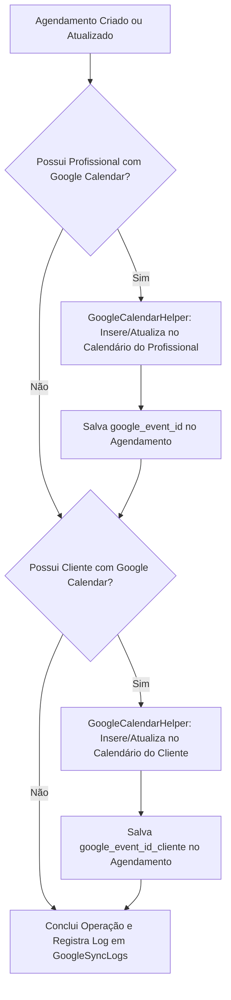

# Plano de Implementação: Correção e Depuração da Integração com Google Agenda

**Data**: 2026-08-21  
**Autor**: Antigravity Assistant  
**Status**: Proposto / Aguardando Aprovação  

---

## 1. Respostas aos Questionamentos

### 1.1. Os dados da integração estão salvos no disco ou no banco?
- **No Banco de Dados (100% Criptografado)**:
  - O JSON da Service Account (`google_service_account_json`) é criptografado com chave simétrica via `EncryptionHelper::encrypt()` e armazenado na tabela `ConfiguracoesEmissor` (tipo `LONGTEXT`).
  - O `GoogleCalendarHelper` recupera o valor diretamente do banco de dados e descriptografa em memória durante a execução.
  - Os IDs de agenda (`google_calendar_id`) estão nas tabelas `Veterinarios` e `Clientes`.
  - Os IDs de eventos (`google_event_id`) estão na tabela `Agendamentos`.
  - **Nenhum arquivo de credencial ou token do Google Calendar está sendo gravado no disco**.

### 1.2. A integração quebrou devido à questão dos convidados do evento?
- **SIM, exatamente por isso**:
  - A API do Google Calendar **proíbe que Contas de Serviço (Service Accounts) enviem convidados (`attendees`)** em eventos a menos que tenham *Domain-Wide Delegation* configurada em domínio corporativo Google Workspace.
  - Ao adicionar `attendees` com os e-mails/IDs dos clientes no payload, a API do Google passou a retornar erro **`HTTP 403 Forbidden: Service accounts cannot invite attendees without domain-wide delegation of authority`**.
  - O `GoogleCalendarHelper` capturava a exceção silenciosamente em `try/catch`, gravava apenas no `error_log` e retornava `null`.
  - Por consequência, a criação do evento era abortada e nenhum evento aparecia nem na agenda do profissional nem na do cliente.

---

## 2. Solução Proposta

### 2.1. Remoção do Bloqueio de Convidados & Sincronização Direta
1. **Remover a propriedade `attendees`** dos métodos `createEvent` e `updateEvent` no `GoogleCalendarHelper.php` (e parâmetros nos chamadores) para evitar o erro HTTP 403 da API.
2. **Sincronização Multi-Calendário Direta**:
   - Quando o profissional possui `google_calendar_id`, cria/atualiza o evento na agenda dele (`google_event_id`).
   - Quando o cliente também possui `google_calendar_id` configurado (agenda compartilhada com o e-mail da Service Account), o sistema insere o evento diretamente na agenda do cliente (`google_event_id_cliente`).
   - Dessa forma, ambos recebem o evento em seus calendários de forma nativa e sem sofrer restrições de Service Account.

### 2.2. Camada de Depuração & Diagnóstico
1. **Nova Tabela de Logs no Banco (`GoogleSyncLogs`)**:
   - Colunas: `id_log`, `data_hora`, `id_agendamento`, `calendar_id`, `tipo_operacao` (`create`, `update`, `delete`, `test`), `status` (`sucesso`, `erro`, `aviso`), `http_code`, `mensagem`, `payload_resumo`.
   - Permite rastrear exatamente o que aconteceu em cada sincronização.
2. **Método `testConnection($calendarId)` no `GoogleCalendarHelper`**:
   - Valida o JSON da Service Account no banco.
   - Testa a obtenção do token OAuth2.
   - Executa uma chamada `get` na agenda especificada para testar permissão de leitura/escrita.
   - Retorna array estruturado `['success' => bool, 'message' => string, 'details' => string]`.
3. **Endpoints de Diagnóstico na API**:
   - `action=test_google_sync`: Permite testar a sincronização em tempo real informando um `calendar_id`.
   - `action=get_google_logs`: Retorna os últimos logs para visualização rápida no painel de administração/agenda.

---

## 3. Arquivos Envolvidos

### Database & Migrations
- [NEW] `database/migrations/20260821_0001_google_sync_logs_and_client_event.sql`: Migration criando a tabela `GoogleSyncLogs` e adicionando a coluna `google_event_id_cliente` na tabela `Agendamentos`.

### Helpers & Backend
- [MODIFY] `dinovatech/helpers/GoogleCalendarHelper.php`:
  - Remoção da propriedade `attendees` causadora do 403.
  - Gravação automática de logs na tabela `GoogleSyncLogs`.
  - Implementação do método `testConnection($calendarId)` e diagnóstico detalhado de erros do Google (extraindo mensagem do Body JSON do Google).
- [MODIFY] `dinovatech/modules/Agenda/api.php`:
  - Atualização da função `syncGoogle` para sincronizar no calendário do funcionário e no calendário do cliente de forma independente.
  - Atualização da função `deleteGoogle` para limpar tanto o evento do funcionário quanto do cliente.
  - Novos endpoints: `test_google_sync` e `get_google_logs`.
- [MODIFY] `dinovatech/modules/Vet/atendimento_form.php`:
  - Ajuste na sincronização para não enviar `attendees` e gerenciar `google_event_id` / `google_event_id_cliente`.

---

## 4. Plano de Verificação

### Verificação do Código
- Verificar se todas as chamadas `syncGoogle` e `GoogleCalendarHelper` tratam corretamente a ausência de `attendees` e registram logs em `GoogleSyncLogs`.
- Verificar compatibilidade com PHP 7.4 e MariaDB.
- Validar que nenhuma credencial ou log com senhas sensíveis é salvo em disco.

### Verificação Operacional no Ambiente Remoto (Após deploy pelo usuário)
1. Executar o teste de diagnóstico via endpoint/painel para validar a conexão da Service Account.
2. Criar um agendamento com funcionário e cliente configurados com `google_calendar_id`.
3. Verificar na tabela `GoogleSyncLogs` o registro com status `sucesso` e a aparição dos eventos nas agendas do Google.
