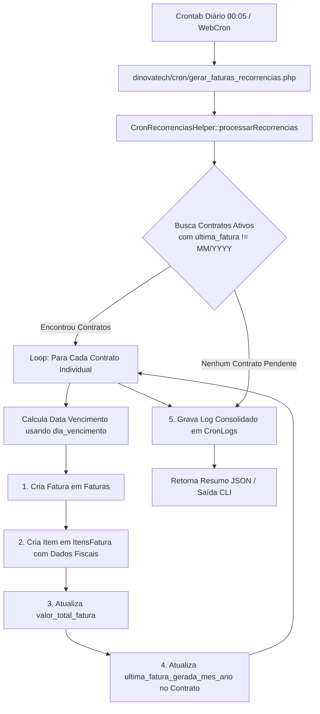

# Plano de Implementação: Automação Diária de Faturas Recorrentes, Campo Dia de Vencimento e Data de Emissão da NFSe

**Data**: 2026-08-22  
**Autor**: Antigravity Assistant  
**Status**: Proposto / Aguardando Aprovação  

---

## 1. Regras de Negócio e Novidades

1. **Campo `dia_vencimento` nos Contratos (`Recorrencias`)**:
   - Adicionada coluna `dia_vencimento` (número de 1 a 31) na tabela `Recorrencias`.
   - Na tela de cadastro/edição de contratos (`contrato_form.php`), o usuário pode definir explicitamente o dia do vencimento da mensalidade (ex: dia 5, 10, 15, 20).
   - **Fallback inteligente**: Caso o contrato seja antigo ou o campo fique vazio, o sistema usa o dia da `data_inicio_cobranca`.
2. **Coluna `data_emissao_nfse` nas Faturas (`Faturas`)**:
   - Adicionada coluna `data_emissao_nfse DATETIME` na tabela `Faturas`.
   - Preenchida automaticamente quando a NFSe é gerada/concluída.
   - O `ContaDevHelper` passa a ler essa data diretamente da fatura, dispensando o parse do XML (mantendo fallback de regex no XML para faturas anteriores).
3. **Automação Diária via Cron (1 Fatura por Contrato)**:
   - O script executa diariamente (às 00:05 via crontab).
   - Na virada do mês (ou no dia em que o contrato iniciar), localiza todos os contratos ativos cuja fatura do mês atual ainda não foi gerada (`ultima_fatura_gerada_mes_ano != MM/YYYY`).
   - Para cada contrato, gera **1 fatura individual**, calcula o vencimento pelo `dia_vencimento` do contrato, insere o item e atualiza `ultima_fatura_gerada_mes_ano`.
   - Grava auditoria completa na tabela `CronLogs`.

---

## 2. Diagrama de Fluxo da Automação



---

## 3. Arquivos Envolvidos

### Database & Migrations
- [NEW] `database/migrations/20260822_0001_cron_recorrencias_and_faturas_fields.sql`:
  - Cria a tabela `CronLogs`.
  - Adiciona `dia_vencimento` na tabela `Recorrencias`.
  - Adiciona `data_emissao_nfse` na tabela `Faturas`.

### Helpers & Backend
- [NEW] `dinovatech/helpers/CronRecorrenciasHelper.php`:
  - Lógica central de busca de contratos ativos, cálculo de vencimento com base em `dia_vencimento` / `data_inicio_cobranca`, criação de faturas 1-para-1, controle de idempotência e logs em `CronLogs`.
- [NEW] `dinovatech/cron/gerar_faturas_recorrencias.php`:
  - Ponto de entrada CLI/Web com autenticação por token de segurança.
- [MODIFY] `dinovatech/helpers/ContaDevHelper.php`:
  - Leitura preferencial de `Faturas.data_emissao_nfse` com fallback no XML da nota.
- [MODIFY] `dinovatech/app.php`:
  - Suporte a `dia_vencimento` nas actions `criar_recorrencia` e `editar_recorrencia`.
  - Atualização de `data_emissao_nfse = NOW()` quando uma NFSe for gerada/concluída.
  - Action `executar_cron_recorrencias_manual` para disparo manual no painel.

### Interfaces
- [MODIFY] `dinovatech/contrato_form.php`:
  - Adição do campo de input `dia_vencimento` (1 a 31) no formulário do contrato.
- [MODIFY] `dinovatech/contratos.php`:
  - Exibição da coluna `Vencimento` (Dia X) na listagem e botão de disparo manual com modal de feedback.

---

## 4. Plano de Verificação

### Verificação do Código
1. Validar criação e edição de contrato definindo `dia_vencimento = 10` e checar gravação no banco.
2. Executar o helper do cron para gerar faturas do mês e checar:
   - 1 fatura criada por contrato.
   - Vencimento calculado exatamente no dia configurado.
   - Flag `ultima_fatura_gerada_mes_ano` atualizada.
   - Log gravado em `CronLogs`.
3. Executar novamente em seguida para validar que nenhuma fatura duplicada é gerada.
4. Validar integração do `ContaDevHelper` lendo `data_emissao_nfse`.

### Configuração no Servidor Remoto (Crontab)
```bash
# Executa todos os dias às 00:05 da madrugada
5 0 * * * docker exec homepage-php php /var/www/html/dinovatech/cron/gerar_faturas_recorrencias.php >> /var/log/dinovatech_cron.log 2>&1
```
