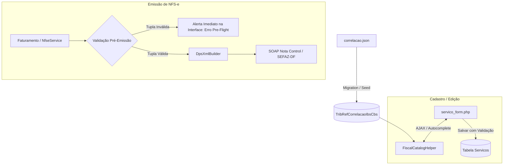

# Plano de Implementação: Correlacionador Fiscal e Validador Pré-Emissão NFS-e Nacional (Erro EM062)

## 1. Visão Geral
Este plano visa blindar o sistema contra o erro `[EM062]` da SEFAZ-DF / Nota Control ("O Cód. Tributação Nacional, NBS, Cód. Ind. Operação e Classificação Tributária precisam estar correlacionados"), garantindo que todo serviço cadastrado e toda nota faturada respeitem estritamente a matriz oficial de correlação da Reforma Tributária (IBS/CBS).

---

## 2. Diagnóstico da Estrutura Atual
1. **Campos Existentes:** ✅ Todos os campos (`codigo_tributacao_nacional`, `codigo_nbs`, `cst_ibs_cbs`, `classificacao_trib_ibs_cbs`, `indicador_operacao`) já existem na tabela `Servicos`, no DTO `DpsData` e no construtor `DpsXmlBuilder`.
2. **Causa do Problema:** O envio falhou porque os valores combinados no serviço faturado não formavam uma linha válida na matriz oficial exigida pela Nota Control para a versão 1.01 da DPS.

---

## 3. Arquitetura da Solução

---

## 4. Etapas de Execução

### Fase 1: Atualização da Base de Correlação Fiscal
- Criar migration SQL / rotina de seed para carregar a matriz completa de `docs/notacontrol/correlacao.json` na tabela `TribRefCorrelacaoIbsCbs`.
- Padronizar os campos na base com zeros à esquerda:
  - `codigo_trib_nac`: `CHAR(6)` (ex: `010701`, `010101`)
  - `codigo_nbs`: `VARCHAR(9)` (ex: `115021000`)
  - `classificacao_trib`: `VARCHAR(6)` (ex: `000001`, `200043`)
  - `cst_ibs_cbs`: `VARCHAR(3)` (ex: `000`, `200`)
  - `indicador_operacao`: `VARCHAR(6)` (ex: `100301`, `100501`)
- Criar índices combinados no banco: `(codigo_trib_nac, codigo_nbs)` e `(codigo_trib_nac, codigo_nbs, classificacao_trib, indicador_operacao)`.

### Fase 2: Motor de Correlação e Validação (`FiscalCatalogHelper`)
Implementar métodos utilitários em `FiscalCatalogHelper`:
1. `validarCorrelacao(string $cTribNac, ?string $cNbs, ?string $cClassTrib, ?string $cIndOp, ?string $cst, $link): array`
   - Retorna `['valido' => true/false, 'erros' => [...], 'sugestoes' => [...]]`.
2. `getNbsDisponiveisPorTribNac(string $cTribNac, $link): array`
   - Retorna a lista de NBS válidos e suas descrições para o `cTribNac` selecionado.
3. `getCorrelacaoPadrao(string $cTribNac, ?string $cNbs, $link): ?array`
   - Retorna a melhor tupla oficial completa para preenchimento automático.

### Fase 3: Aprimoramento da Interface de Cadastro (`servico_form.php`)
1. **Seleção guiada de NBS:** Ao selecionar ou preencher o `cTribNac`, listar dinamicamente apenas os `cNBS` válidos em um `<select>` ou autocomplete com pesquisa.
2. **Autopreenchimento de IBS/CBS:** Ao selecionar o NBS correspondente, preencher automaticamente `cIndOp`, `cClassTrib` e `CST` com os valores exatos da matriz.
3. **Badge de Status de Conformidade Fiscal:** Exibir um indicador visual no formulário:
   - 🟢 *Combinação Fiscal Válida para NFS-e Nacional*
   - 🔴 *Atenção: A combinação atual viola a correlação oficial (Erro EM062).*
4. **Validação no backend (`app.php`):** Bloquear o salvamento caso a combinação seja explicitamente inválida, orientando o usuário.

### Fase 4: Validação Pré-Emissão (Pre-flight Check no `NfseService`)
- No método `emitirFatura()`, antes de gerar o XML da DPS e enviar via SOAP:
  - Executar `FiscalCatalogHelper::validarCorrelacao(...)`.
  - Se a tupla for inválida, abortar a chamada externa e retornar `EmissionResult::error("Inconsistência Fiscal [EM062]: O serviço selecionado possui parâmetros de IBS/CBS incompatíveis. Acesse o cadastro de serviços e revalide os campos.")`.
  - Isso evita rejeições remotas desnecessárias e preserva o histórico limpo.

### Fase 5: Auditoria de Serviços Cadastrados (`servicos.php`)
- Na tela de listagem de serviços (`servicos.php`), adicionar um selo/indicador visual para identificar imediatamente quais serviços já cadastrados possuem ou não correlação válida na matriz nacional.

---

## 5. Plano de Testes
1. Testar preenchimento de serviços com códigos reais (TI, Veterinária, Hospedagem Pet, etc.).
2. Testar validação pré-emissão tentando emitir com dados incorretos e verificando o bloqueio amigável.
3. Testar emissão com tupla 100% correlacionada no ambiente de testes/produção da NFS-e Nacional.
