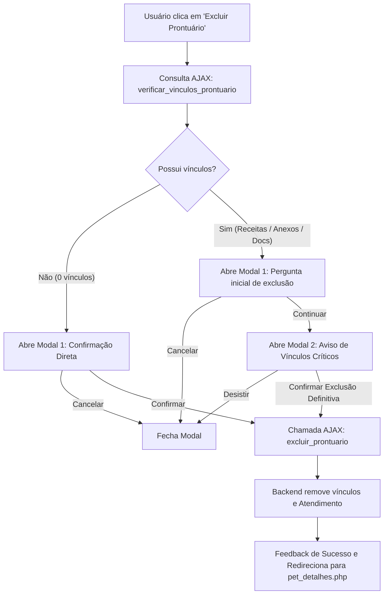

# Plano de Implementação: Exclusão de Prontuário com Validação de Vínculos e Confirmações em Modais

- **Data**: 03/10/2026
- **Módulo**: Vet (`dinovatech/modules/Vet/atendimento_form.php`) e API Backend (`dinovatech/app.php`)
- **Objetivo**: Permitir a exclusão de prontuários (atendimentos clínicos), visando remover testes ou duplicatas, garantindo segurança com validação prévia de vínculos (receitas, anexos e documentos emitidos) e um fluxo de confirmação em duas etapas via modais interativos antes da remoção definitiva.

---

## 1. Arquivos Envolvidos
1. `dinovatech/app.php`:
   - Nova action AJAX: `verificar_vinculos_prontuario` (retorna contagem de receitas, anexos e documentos emitidos).
   - Nova action AJAX: `excluir_prontuario` (remove documentos emitidos, arquivos vinculados e receitas/itens vinculados antes de deletar o atendimento de forma atômica/segura).
2. `dinovatech/modules/Vet/atendimento_form.php`:
   - Botão "Excluir Prontuário" no cabeçalho de ações da aba `#prontuario` (visível apenas em edição de prontuário existente).
   - Modal 1: Confirmação inicial de exclusão do prontuário.
   - Modal 2: Alerta com aviso destacado de vínculos existentes (receitas, anexos, documentos) e confirmação final definitiva.
   - Funções JavaScript para orquestrar a verificação, abertura dos modais, execução assíncrona e redirecionamento para `pet_detalhes.php?id={id_pet}#historico`.

---

## 2. Fluxo da Operação



---

## 3. Detalhamento do Backend (`dinovatech/app.php`)

### 3.1. Action: `verificar_vinculos_prontuario`
- **Entrada**: `id_atendimento`
- **Consultas**:
  - `Receitas`: `SELECT COUNT(*) AS total FROM Receitas WHERE id_atendimento = $id_atendimento`
  - `AtendimentoArquivos`: `SELECT COUNT(*) AS total FROM AtendimentoArquivos WHERE id_atendimento = $id_atendimento`
  - `DocumentosEmitidos`: `SELECT COUNT(*) AS total FROM DocumentosEmitidos WHERE id_atendimento = $id_atendimento`
  - `Atendimentos`: `SELECT id_pet, data_atendimento, queixa_principal FROM Atendimentos WHERE id_atendimento = $id_atendimento`
- **Retorno JSON**:
  ```json
  {
    "success": true,
    "data": {
      "id_atendimento": 52,
      "id_pet": 2,
      "receitas": 1,
      "anexos": 2,
      "documentos": 1,
      "total_vinculos": 4
    }
  }
  ```

### 3.2. Action: `excluir_prontuario`
- **Entrada**: `id_atendimento`
- **Execução**:
  1. Validação de existência do atendimento e captura do `id_pet`.
  2. Limpeza de `DocumentosEmitidos` vinculados ao atendimento.
  3. Limpeza de anexos:
     - Identifica `id_arquivo` associados em `AtendimentoArquivos`.
     - Remove de `AtendimentoArquivos` e de `Arquivos`.
  4. Limpeza de receitas:
     - Remove `ItensReceita` vinculados às receitas do atendimento.
     - Remove `Receitas` do atendimento.
  5. Desvinculação do agendamento (caso necessário): limpa FK se houver, ou mantém Agendamentos com `status` inalterado/desassociado.
  6. Remoção de `Atendimentos`: `DELETE FROM Atendimentos WHERE id_atendimento = $id_atendimento`.
- **Retorno JSON**:
  ```json
  {
    "success": true,
    "message": "Prontuário excluído com sucesso!",
    "redirect_url": "pet_detalhes.php?id=2#historico"
  }
  ```

---

## 4. Detalhamento do Frontend (`dinovatech/modules/Vet/atendimento_form.php`)

### 4.1. Botão "Excluir Prontuário"
Localizado na barra de ações de topo da aba Prontuário, ao lado do botão "Salvar Prontuário":
- Exibição condicional: `<?php if ($is_edit): ?>`.
- Estilizado com Tailwind: cor vermelha suave (`bg-white hover:bg-red-50 text-red-600 border border-red-200 hover:border-red-300 font-bold py-3 px-5 rounded-lg shadow-sm flex items-center transition`).
- Ícone Material Icons: `delete_outline`.

### 4.2. Modal 1: Confirmação Inicial (`modal-excluir-prontuario-step1`)
- Layout clean, backdrop escuro com blur leve (`fixed inset-0 bg-gray-900 bg-opacity-50 z-50`).
- Card centralizado com ícone `delete` vermelho em badge circular.
- Mensagem clara sobre a intenção de exclusão do prontuário #ID.
- Botões: "Cancelar" e "Prosseguir".

### 4.3. Modal 2: Alerta de Vínculos Existentes (`modal-excluir-prontuario-step2`)
- Acionado quando a verificação identificar `total_vinculos > 0`.
- Badge com ícone `warning` âmbar/vermelho.
- Título: "Atenção: Registros Vinculados Encontrados!".
- Resumo visual em cards/badges com contadores dinâmicos:
  - Quantidade de receitas
  - Quantidade de arquivos anexados
  - Quantidade de documentos emitidos
- Aviso enfático de que esses itens também serão excluídos permanentemente.
- Botões: "Voltar / Cancelar" e "Sim, Excluir Tudo Permanentemente" (com spinner/desativação de clique durante a chamada).

---

## 5. Plano de Validação e Testes
1. Validar se o botão só aparece quando o prontuário já foi salvo (`$is_edit = true` ou `$id_atendimento` presente).
2. Testar o fluxo em prontuário SEM receitas, SEM anexos e SEM documentos:
   - Clicar em "Excluir Prontuário".
   - Confirmar no Modal 1.
   - O registro é removido e redirecionado para a ficha do pet.
3. Testar o fluxo em prontuário COM vínculos (receita, arquivo anexo ou documento):
   - Clicar em "Excluir Prontuário".
   - Confirmar no Modal 1.
   - O Modal 2 deve abrir exibindo as quantidades exatas de receitas, anexos e documentos.
   - Clicar em "Sim, Excluir Tudo Permanentemente".
   - Verificar remoção completa dos registros do banco e redirecionamento.
