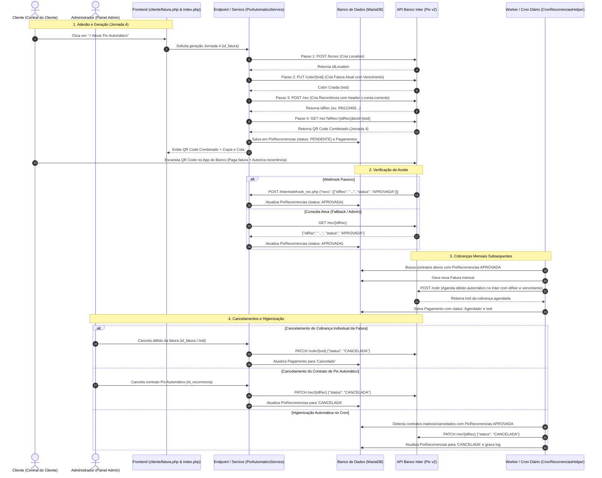

# Workflow: Fluxo Completo Pix Automático Jornada 4 e Ciclo de Vida (Banco Inter)

**Data:** 2026-09-07  

## Diagrama de Sequência

```mermaid
sequenceDiagram
    autonumber
    actor Cliente as Cliente (Central do Cliente)
    actor Admin as Administrador (Painel Admin)
    participant Front as Frontend (cliente/fatura.php & index.php)
    participant Backend as Endpoint / Service (PixAutomaticoService)
    participant DB as Banco de Dados (MariaDB)
    participant Inter as API Banco Inter (Pix v2)
    participant Cron as Worker / Cron Diário (CronRecorrenciasHelper)

    Note over Cliente, Front: 1. Adesão e Geração (Jornada 4)
    Cliente->>Front: Clica em "⚡ Ativar Pix Automático"
    Front->>Backend: Solicita geração Jornada 4 (id_fatura)
    Backend->>Inter: Passo 1: POST /locrec (Cria Location)
    Inter-->>Backend: Retorna idLocation
    Backend->>Inter: Passo 2: PUT /cobv/{txid} (Cria Fatura Atual com Vencimento)
    Inter-->>Backend: CobV Criada (txid)
    Backend->>Inter: Passo 3: POST /rec (Cria Recorrência com header x-conta-corrente)
    Inter-->>Backend: Retorna idRec (ex: RN123456...)
    Backend->>Inter: Passo 4: GET /rec?idRec={idRec}&txid={txid}
    Inter-->>Backend: Retorna QR Code Combinado (Jornada 4)
    Backend->>DB: Salva em PixRecorrencias (status: PENDENTE) e Pagamentos
    Backend-->>Front: Exibe QR Code Combinado + Copia e Cola
    Cliente->>Inter: Escaneia QR Code no App do Banco (Paga fatura + Autoriza recorrência)

    Note over Inter, DB: 2. Verificação de Aceite
    alt Webhook Passivo
        Inter->>Backend: POST /inter/webhook_rec.php {"recs": [{"idRec": "...", "status": "APROVADA"}]}
        Backend->>DB: Atualiza PixRecorrencias (status: APROVADA)
    else Consulta Ativa (Fallback / Admin)
        Backend->>Inter: GET /rec/{idRec}
        Inter-->>Backend: {"idRec": "...", "status": "APROVADA"}
        Backend->>DB: Atualiza PixRecorrencias (status: APROVADA)
    end

    Note over Cron, Inter: 3. Cobranças Mensais Subsequentes
    Cron->>DB: Busca contratos ativos com PixRecorrencias APROVADA
    Cron->>DB: Gera nova Fatura mensal
    Cron->>Inter: POST /cobr (Agenda débito automático no Inter com idRec e vencimento)
    Inter-->>Cron: Retorna txid da cobrança agendada
    Cron->>DB: Salva Pagamento com status 'Agendado' e txid

    Note over Admin, Inter: 4. Cancelamentos e Higienização
    alt Cancelamento de Cobrança Individual da Fatura
        Admin->>Backend: Cancela débito da fatura (id_fatura / txid)
        Backend->>Inter: PATCH /cobr/{txid} {"status": "CANCELADA"}
        Backend->>DB: Atualiza Pagamento para 'Cancelado'
    else Cancelamento do Contrato de Pix Automático
        Admin->>Backend: Cancela contrato Pix Automático (id_recorrencia)
        Backend->>Inter: PATCH /rec/{idRec} {"status": "CANCELADA"}
        Backend->>DB: Atualiza PixRecorrencias para 'CANCELADA'
    else Higienização Automática no Cron
        Cron->>DB: Detecta contratos inativos/cancelados com PixRecorrencias APROVADA
        Cron->>Inter: PATCH /rec/{idRec} {"status": "CANCELADA"}
        Cron->>DB: Atualiza PixRecorrencias para 'CANCELADA' e grava log
    end
```
