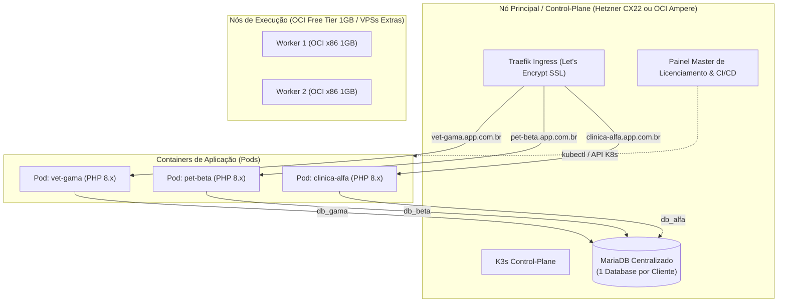
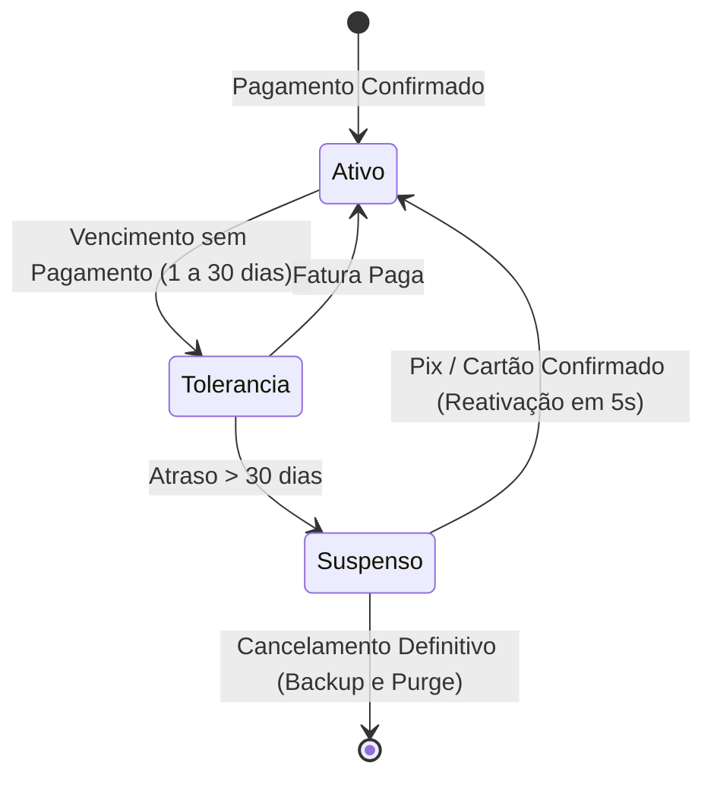

# Arquitetura e Planejamento: SaaS Multi-Tenant por Isolamento de Containers (K3s)

Este documento consolida a estratégia técnica e de negócios para comercialização do **Dinovatech**, preservando a base de código PHP existente e escalando via orquestração de containers.

---

## 1. Decisão Estratégica de Arquitetura

### 1.1 Diagnóstico do Código Atual
* O sistema é estruturado em PHP procedural/estruturado com queries manuais SQL (`DBExecute`, `mysqli_query`).
* Possui forte acoplamento com recursos sensíveis por cliente:
  * **Módulo Fiscal (NFS-e)**: Certificados A1 (`.pfx`), chaves privadas, senhas e controle sequencial de RPS/Lotes.
  * **Financeiro & Webhooks**: Integrações (InfinitePay, Google Calendar) e crons de recorrência.
  * **Módulo Veterinário**: Alternância de modo via variáveis de ambiente (`APP_MODE_VET`).

### 1.2 Comparativo: Container-per-Tenant vs. SaaS Monolítico (Banco Compartilhado)

| Critério | Multi-Tenant por Container (Escolhido) | SaaS Monolítico (Banco Único) |
| :--- | :--- | :--- |
| **Time to Market** | **Imediato (1 a 2 semanas)** | **Longo (3 a 6 meses)** |
| **Refatoração de SQL** | **Zero** — Código roda como está hoje | **Massiva** — Adicionar `WHERE tenant_id = ?` em centenas de arquivos |
| **Risco LGPD / Vazamento** | **Nulo** — Bancos e processos 100% isolados | **Alto** — Uma falha de query expõe dados de outro cliente |
| **Certificados Fiscais A1** | **Seguro e Simples** (armazenado por container) | **Complexo** (múltiplos certificados em concorrência de sessão) |
| **Controle de Inadimplência**| **Nível de Infraestrutura** (`scale replicas=0`) | **Nível de Código** (middlewares e flags em banco) |

---

## 2. Topologia de Infraestrutura (Cluster K3s Multi-Provedor)

O cluster conecta servidores heterogêneos usando **K3s** com rede interna segura (WireGuard / Flannel Native):



### 2.1 Otimização para VPSs de Baixo Custo (1 vCPU / 1 GB RAM)
* **O Problema de Memória**: Rodar 1 instância completa de MariaDB por Pod consome ~150 MB a 250 MB de RAM cada, inviabilizando VPSs de 1 GB.
* **A Solução (Database-per-Tenant)**: 
  * Roda-se **1 único servidor MariaDB** otimizado.
  * Cada cliente ganha seu próprio banco e usuário isolados (`db_cliente1`, `db_cliente2`).
  * Os containers PHP (`dinovatech-app`) consomem apenas **25 MB a 40 MB de RAM** em repouso.
  * Com isso, mesmo nós pequenos (1 GB de RAM com Swap) suportam múltiplos clientes.

---

## 3. Regras de Negócio e Controle de Inadimplência

A gestão de inadimplência opera em 3 camadas de ciclo de vida:



1. **Dia 0 a 30 de atraso (Tolerância com Aviso)**:
   * Pod de aplicação continua rodando normalmente.
   * Sistema valida a licença e exibe banner no topo: *"Sua mensalidade está em aberto. Evite a interrupção dos serviços."*
   * Nenhuma funcionalidade médica/fiscal é bloqueada.

2. **Após 30 dias de atraso (Suspensão de Infraestrutura)**:
   * O Painel Master executa:
     ```bash
     kubectl scale deployment app -n cliente-x --replicas=0
     ```
   * **Benefícios**:
     * Libera 100% da memória RAM alocada para o PHP do cliente.
     * Interrompe crons, disparos automáticos e webhooks.
     * Os dados no banco de dados e arquivos de upload **permanecem 100% preservados**.
   * O Ingress redireciona o tráfego para a página global de bloqueio/pagamento com QR Code Pix da InfinitePay.

3. **Reativação Instantânea**:
   * O webhook de pagamento da InfinitePay notifica o Painel Master.
   * O painel executa `kubectl scale deployment app -n cliente-x --replicas=1`.
   * O sistema do cliente volta ao ar em menos de 5 segundos.

---

## 4. Pipeline de Updates (CI/CD, GitHub Tags e Auto-Update)

### 4.1 Fluxo de Entrega Contínua
1. **Desenvolvimento Local / Servidor Remoto**: Código finalizado e testado.
2. **Criação de Tag**: `git tag v1.3.0 && git push origin v1.3.0`.
3. **GitHub Actions**:
   * Compila a imagem Docker multi-arch (`linux/amd64`, `linux/arm64`).
   * Envia para o registry (`ghcr.io/seu-usuario/dinovatech:v1.3.0`).
   * Dispara webhook para o Painel Master avisando a disponibilidade da nova versão.

### 4.2 Janela de Atualização na Madrugada
* O Painel Master gerencia grupos de atualização:
  * **Grupo 1 (Auto-Update Ativo)**: Agendado via cron diário às **03:00 AM**.
  * **Grupo 2 (Manual / Estável)**: Atualizado apenas sob demanda pelo painel.
* **Execução do Rolling Update no K3s**:
  ```bash
  kubectl set image deployment/app dinovatech=ghcr.io/seu-usuario/dinovatech:v1.3.0 -n cliente-x
  ```
* **Migração Automática de Banco**: O script de inicialização do container (`entrypoint.sh`) executa as migrações SQL pendentes antes de disponibilizar as requisições HTTP.

---

## 5. Roteiro de Implementação (Roadmap)

### Fase 1: Dockerização do Dinovatech
- [ ] Criar `Dockerfile` (PHP 8.2/8.3 + Apache/Nginx + extensões `mysqli`, `soap`, `xml`, `openssl`, `gd`, `zip`).
- [ ] Criar `docker-compose.yml` local para testes de subida rápida.
- [ ] Parametrizar todas as credenciais sensíveis via variáveis de ambiente (`.env`).

### Fase 2: Mecanismo de Licenciamento (Client & Server)
- [ ] Criar `LicenseHelper.php` dentro do Dinovatech com cache local JWT (tolerância offline de 3 a 7 dias).
- [ ] Criar API simples no Painel Master para validação de licenças (`/api/v1/license/verify`).
- [ ] Implementar tela de bloqueio e banner de aviso de fatura em aberto.

### Fase 3: Setup do Cluster K3s & Ingress
- [ ] Instalar K3s no servidor principal (OCI ou VPS econômica como Hetzner).
- [ ] Configurar Cert-Manager para emissão automática de SSL Let's Encrypt via subdomínios (`*.app.com.br`).
- [ ] Criar template YAML / Helm Chart base para provisionamento de novos tenants.

### Fase 4: Automação do Painel Master
- [ ] Interface para criar novos clientes (geração de DB, namespace K3s e chave de licença em 1 clique).
- [ ] Integração com webhook InfinitePay para renovação automática e reativação de pods suspensos.
- [ ] Agendador de updates noturnos com monitoramento de status.
