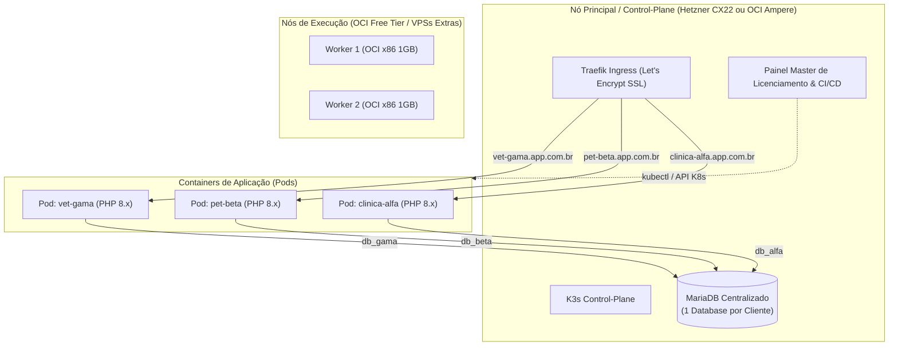
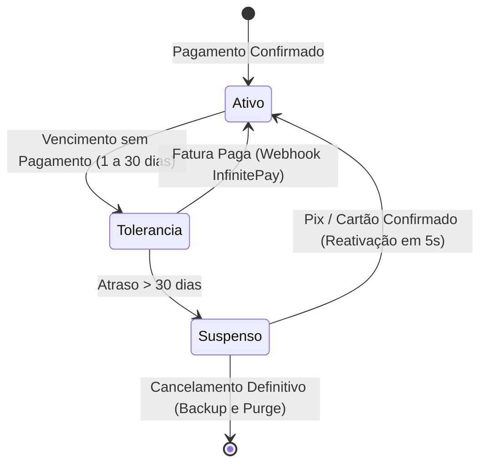

# Arquitetura e Planejamento: SaaS Multi-Tenant por Isolamento de Containers (K3s)

Este documento consolida a estratégia técnica, de infraestrutura e de negócios para a comercialização do **Dinovatech**, preservando a base de código PHP existente e escalando via orquestração de containers.

---

## 1. Decisão Estratégica de Arquitetura

### 1.1 Diagnóstico do Código Atual
* O sistema é estruturado em PHP procedural/estruturado com queries manuais SQL (`DBExecute`, `mysqli_query`).
* Possui forte acoplamento com recursos sensíveis por cliente:
  * **Módulo Fiscal (NFS-e)**: Certificados A1 (`.pfx`), chaves privadas, senhas e controle sequencial de RPS/Lotes.
  * **Financeiro & Webhooks**: Integrações (InfinitePay, Google Calendar) e crons de recorrência.
  * **Módulo Veterinário**: Alternância de modo via variáveis de ambiente (`APP_MODE_VET`).

### 1.2 Comparativo: Container-per-Tenant vs. SaaS Monolítico (Banco Compartilhado)

| Critério | Multi-Tenant por Container (Escolhido) | SaaS Monolítico (Banco Único) |
| :--- | :--- | :--- |
| **Time to Market** | **Imediato (1 a 2 semanas)** | **Longo (3 a 6 meses)** |
| **Refatoração de SQL** | **Zero** — Código roda como está hoje | **Massiva** — Adicionar `WHERE tenant_id = ?` em centenas de arquivos |
| **Risco LGPD / Vazamento** | **Nulo** — Bancos e processos 100% isolados | **Alto** — Uma falha de query expõe dados de outro cliente |
| **Certificados Fiscais A1** | **Seguro e Simples** (armazenado por container) | **Complexo** (múltiplos certificados em concorrência de sessão) |
| **Controle de Inadimplência**| **Nível de Infraestrutura** (`scale replicas=0`) | **Nível de Código** (middlewares e flags em banco) |

---

## 2. Topologia de Infraestrutura (Cluster K3s Multi-Provedor)

O cluster conecta servidores heterogêneos usando **K3s** com rede interna segura (WireGuard / Flannel Native):



### 2.1 Otimização para VPSs de Baixo Custo (1 vCPU / 1 GB RAM)
* **O Problema de Memória**: Rodar 1 instância completa de MariaDB por Pod consome ~150 MB a 250 MB de RAM cada, inviabilizando VPSs de 1 GB.
* **A Solução (Database-per-Tenant)**: 
  * Roda-se **1 único servidor MariaDB** otimizado.
  * Cada cliente ganha seu próprio banco e usuário isolados (`db_cliente1`, `db_cliente2`).
  * Os containers PHP (`dinovatech-app`) consomem apenas **25 MB a 40 MB de RAM** em repouso.
  * Com isso, mesmo nós pequenos (1 GB de RAM com Swap) suportam múltiplos clientes.

---

## 3. Gestão de Nuvem OCI (Oracle Cloud) & Estratégia de Custos

### 3.1 Limites Always Free e Separação de Cotas
As cotas da Oracle Cloud são totalmente **independentes por tipo de serviço**:

| Serviço | Cota Gratuita (Always Free) | Impacto no Disco da VM? |
| :--- | :--- | :--- |
| **Discos de VM (Block Volume)** | **200 GB no total da conta** | *(É a própria cota de boot/dados)* |
| **Instâncias Ampere ARM** | **Até 2 OCPUs / 12 GB RAM** (ou 4 OCPUs / 24 GB) | ❌ Não desconta do disco |
| **Instâncias AMD Micro** | **2 instâncias (1 vCPU / 1 GB RAM cada)** | ❌ Não desconta do disco |
| **Object Storage (S3)** | **10 GB Standard + 10 GB Archive** | ❌ **Cota 100% isolada** |
| **Autonomous Database** | **2 instâncias com 20 GB cada (Total 40 GB)** | ❌ **Cota 100% isolada** |
| **Tráfego de Saída (Egress)** | **10 TB / mês gratuitos** | ❌ Não desconta de nada |

### 3.2 Upgrade para Pay As You Go (PAYG) - Diretrizes e Vantagens
* **Fatura R$ 0,00 Garantida**: A política oficial da Oracle isenta integralmente os recursos Always Free em contas PAYG enquanto mantidos dentro dos limites.
* **Principais Vantagens do PAYG**:
  1. **Prioridade Máxima de Hardware**: Elimina o erro *"Out of host capacity"* na criação de instâncias ARM.
  2. **Imunidade Total à Política de Ociosidade**: Contas PAYG **nunca** sofrem desligamento automático por baixa utilização de CPU/RAM.
  3. **Acesso a Outras Regiões e Serviços Avançados**.
* **Travas de Segurança Obrigatórias no PAYG**:
  * Manter a soma de todos os discos de boot e volumes anexados **<= 200 GB**.
  * Criar as instâncias Always Free **apenas na Home Region**.
  * Configurar um **Budget Alert (Orçamento)** no painel da Oracle com limite de **R$ 2,00** para receber alertas imediatos por e-mail caso haja qualquer cobrança indesejada.

### 3.3 Política de Ociosidade em Contas Free Puras (Script Anti-Idle)
Em contas gratuitas sem PAYG, instâncias com menos de 20% de CPU/RAM/Rede por 7 dias são pausadas pela Oracle. Para evitar isso enquanto a VM não tiver carga real:
```bash
# Executar uma carga leve de 60s a cada 3 horas via cron
sudo apt-get install stress-ng -y
# Crontab: 0 */3 * * * stress-ng --cpu 2 --cpu-load 25 --timeout 60s
```

---

## 4. Trigger de Pagamento, Inadimplência e Ciclo de Vida

A gestão de inadimplência opera de forma automatizada integrando o **Webhook da InfinitePay** com a API do **Kubernetes (K3s)**:



### 4.1 Fases do Ciclo de Cobrança

1. **Dia 0 a 30 de atraso (Tolerância com Aviso)**:
   * Pod de aplicação continua rodando normalmente.
   * Sistema valida a licença e exibe banner no topo do painel: *"Sua mensalidade está em aberto. Evite a interrupção dos serviços."*
   * Nenhuma funcionalidade médica/fiscal é interrompida.

2. **Após 30 dias de atraso (Suspensão de Infraestrutura)**:
   * O Painel Master executa via API K8s:
     ```bash
     kubectl scale deployment app -n cliente-x --replicas=0
     ```
   * **Benefícios**:
     * Libera 100% da memória RAM alocada para o PHP do cliente.
     * Interrompe crons, disparos automáticos e webhooks do cliente.
     * Os dados no banco de dados e arquivos de upload **permanecem 100% preservados**.
   * O Ingress redireciona o tráfego para a página global estática de bloqueio com QR Code Pix dinâmico.

3. **Trigger de Pagamento & Reativação Instantânea**:
   * O cliente realiza o pagamento do Pix na tela de bloqueio.
   * O webhook da **InfinitePay** envia a confirmação `transaction_paid` para o Painel Master.
   * O Painel Master atualiza a licença e executa imediatamente:
     ```bash
     kubectl scale deployment app -n cliente-x --replicas=1
     ```
   * O Pod de aplicação sobe e o sistema do cliente volta ao ar em **menos de 5 segundos**.

---

## 5. Domínios Personalizados (Custom Domains)

Para clientes que desejam utilizar domínio próprio (ex: `sistema.clinicavetdovale.com.br`) em vez do subdomínio padrão (`cliente.app.com.br`):

### 5.1 Caddy com On-Demand TLS (Abordagem Recomendada)
* O cliente aponta um registro CNAME `sistema.clinica.com.br` -> `app.seudominio.com.br`.
* Na primeira requisição, o Caddy consulta a API do Painel Master: `GET /api/v1/check-domain?domain=sistema.clinica.com.br`.
* Se o domínio estiver cadastrado e ativo, o Caddy emite o certificado SSL Let's Encrypt em tempo real e libera o tráfego.

### 5.2 Traefik + Cert-Manager no K3s
* Ao cadastrar o domínio próprio no painel, o manifesto do `Ingress` é atualizado adicionando o novo host nas regras e na seção `tls.hosts`.
* O Cert-Manager valida o CNAME e gera o secret TLS automaticamente.

---

## 6. Pipeline de Updates (CI/CD, GitHub Tags e Auto-Update)

### 6.1 Fluxo de Entrega Contínua
1. **Desenvolvimento Local / Servidor Remoto**: Código testado e validado.
2. **Criação de Tag**: `git tag v1.3.0 && git push origin v1.3.0`.
3. **GitHub Actions (ou Gitea Actions)**:
   * Compila a imagem Docker multi-arch (`linux/amd64`, `linux/arm64`).
   * Envia para o registry (`ghcr.io/seu-usuario/dinovatech:v1.3.0`).
   * Dispara webhook para o Painel Master avisando a nova versão.

### 6.2 Janela de Atualização na Madrugada
* O Painel Master gerencia grupos de atualização:
  * **Grupo 1 (Auto-Update Ativo)**: Agendado via cron diário às **03:00 AM**.
  * **Grupo 2 (Manual / Estável)**: Atualizado apenas sob demanda pelo painel.
* **Execução do Rolling Update no K3s**:
  ```bash
  kubectl set image deployment/app dinovatech=ghcr.io/seu-usuario/dinovatech:v1.3.0 -n cliente-x
  ```
* **Migração Automática de Banco**: O script de inicialização do container (`entrypoint.sh`) executa as migrações SQL pendentes antes de liberar o tráfego HTTP.

---

## 7. Roteiro de Implementação (Roadmap)

### Fase 1: Dockerização do Dinovatech
- [ ] Criar `Dockerfile` multi-arch (PHP 8.2/8.3 + Apache/Nginx + extensões `mysqli`, `soap`, `xml`, `openssl`, `gd`, `zip`).
- [ ] Criar `docker-compose.yml` local para testes de subida rápida.
- [ ] Parametrizar todas as credenciais sensíveis via variáveis de ambiente (`.env`).

### Fase 2: Mecanismo de Licenciamento & Triggers
- [ ] Criar `LicenseHelper.php` dentro do Dinovatech com cache local JWT (tolerância offline de 3 a 7 dias).
- [ ] Criar API no Painel Master para validação de licenças (`/api/v1/license/verify`).
- [ ] Integrar webhook da InfinitePay com rotina de desbloqueio automático de Pods.
- [ ] Implementar banner de aviso (0 a 30 dias) e tela global de bloqueio pós 30 dias.

### Fase 3: Setup do Cluster K3s & Nuvem
- [ ] Provisionar instância ARM na OCI (ou VPS econômica como Hetzner) e realizar upgrade para PAYG.
- [ ] Instalar K3s e configurar Traefik/Caddy com Cert-Manager para SSL wildcard/on-demand.
- [ ] Criar templates YAML / Helm base para provisionamento de novos tenants.

### Fase 4: Automação do Painel Master
- [ ] Interface para criar novos clientes (geração de DB, namespace K3s e chave de licença em 1 clique).
- [ ] Orquestrador de comandos `kubectl scale` para suspensão e reativação.
- [ ] Agendador de updates noturnos com monitoramento de status.
